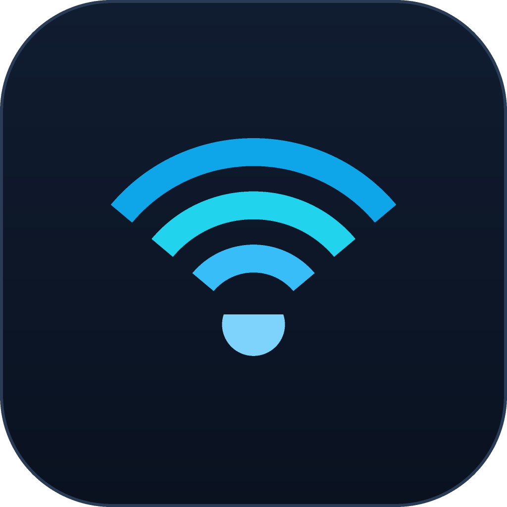

  

<h1 align="center">NetScope</h1>

  <strong>Professional network analyzer &amp; diagnostics suite for Windows</strong> 
  Real diagnostics. Real data. No mockups.

  <a href="#download"><b>⬇ Download</b></a> ·
  <a href="#features"><b>Features</b></a> ·
  <a href="#getting-started"><b>Getting Started</b></a> ·
  <a href="#privacy"><b>Privacy</b></a> ·
  <a href="#support"><b>Support</b></a>

---

## What is NetScope?

NetScope is a desktop application for diagnosing, measuring, and monitoring your
network — built for developers, system administrators, students, gamers, and
power users. It bundles the day-to-day tools you otherwise juggle between
terminals and web pages into one polished Windows app:

- Is my internet actually down — and *which* part of the path is broken?
- How fast is my connection, really?
- Why is my game lagging? Where do packets get lost?
- Which DNS server is quickest *from my machine*?
- What is every program on my PC connecting to right now?

Every number you see comes from a real network operation, a Windows API, or
your local interfaces. Nothing is simulated.

## Download

Grab the latest installer from [**Releases**](../../releases):

| File | For |
| --- | --- |
| `NetScope_1.0.0_x64-setup.exe` | Windows 10/11 (64-bit) — standard installer |
| `NetScope_1.0.0_x64_en-US.msi` | Windows Installer format — for IT deployment / Group Policy |

Requirements: Windows 10 (1809+) or Windows 11, 64-bit. No runtime
dependencies — WebView2 ships with Windows 10/11.

> **SmartScreen note:** the installers are not code-signed yet, so Windows may
> show "Windows protected your PC". Click *More info → Run anyway*. This is
> expected for unsigned community software.

## Features

**Diagnostics**
- 🔍 **Ping** — real ICMP with live latency chart, min/avg/max, jitter and
  packet-loss stats; finite runs or continuous monitoring with pause/resume
- 🛣️ **Traceroute** — per-hop latency with multiple probes, reverse DNS,
  problematic-hop highlighting, visual hop timeline
- 🌐 **DNS analyzer** — resolve A, AAAA, CNAME, MX, TXT, NS, SOA and PTR
  records against any server, with per-query timing
- 🏁 **DNS benchmark** — compare Cloudflare, Google, Quad9 or your own servers;
  success rate, min/avg/max, timeout counts, per-server transport reporting
- 🔌 **HTTP/TCP/UDP tests** — full request timing breakdown (DNS, TCP, TLS,
  TTFB, download) plus port connectivity checks

**Performance**
- ⚡ **Speed test** — real download/upload throughput against a configurable
  endpoint (Cloudflare by default) with a live speed graph, peak and average
- 📊 **Bandwidth monitor** — live per-interface upload/download rates straight
  from Windows byte counters

**Visibility**
- 📈 **Dashboard** — live internet status, latency, packet loss, public/local
  IP, gateway, DNS, and a health checklist that *explains* each verdict
- 🔗 **Connections** — every active TCP/UDP connection with owning process
- 📶 **Interfaces & Wi-Fi** — adapter details, IPs, MAC, gateways, link speed;
  native Windows WLAN data: SSID, BSSID, signal, band, channel, security

**Workflow**
- 🗄️ **History** — every run persisted locally in SQLite, browsable and
  exportable to CSV
- 🧾 **Reports** — one-click full-system diagnostic reports exported as
  Markdown, HTML or JSON
- ⚙️ **Settings** — timeouts, thresholds, default endpoints; everything stored
  locally
- ⌨️ **Command palette** (`Ctrl+K`) — jump to any tool from the keyboard

## Getting Started

1. Download and run an installer from [Releases](../../releases).
2. Launch **NetScope** — the Dashboard lights up immediately with your live
   network status.
3. Try a **Speed Test**, then run a **DNS benchmark** to see which resolver is
   fastest on your connection.
4. Optional: open **Monitoring**, add the hosts you care about (e.g.
   `1.1.1.1` and your router), and NetScope will keep watching them in the
   background and record every check.

### Tips

- **UDP DNS note:** some networks block UDP port 53. NetScope automatically
  falls back to DNS-over-TCP (RFC 7766) and tells you which transport was
  used — if you see *TCP (after UDP failure)*, that's your network filtering
  UDP DNS.
- **Wi-Fi page** needs the Windows WLAN AutoConfig service (on by default).
- All exports (CSV / report files) go where you choose with a native save
  dialog.

## Privacy

NetScope is local-first:

- No telemetry, no analytics, no accounts.
- Results are stored **only** in a local SQLite database under your user
  profile (`%APPDATA%\com.netscope.app`).
- The only outbound requests are the network tests you trigger (pings, DNS
  queries, the speed-test endpoint you configure, HTTP checks you enter).
- Reports are generated locally and uploaded nowhere — exporting or sharing
  them is always an explicit action by you.

Full details in the [Security Policy](https://github.com/Itz-Npg/netscope-source/blob/main/SECURITY.md).

## Support

- Found a bug or want a feature? [Open an issue](https://github.com/Itz-Npg/netscope/issues).
- Troubleshooting tips live in the
  [TROUBLESHOOTING guide](https://github.com/Itz-Npg/netscope-source/blob/main/TROUBLESHOOTING.md).
- Source code & developer documentation: [Itz-Npg/netscope-source](https://github.com/Itz-Npg/netscope-source).

## License

MIT — see [LICENSE](https://github.com/Itz-Npg/netscope-source/blob/main/LICENSE).
